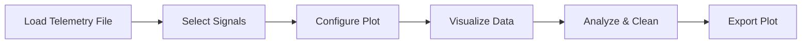

<h1 align="center">📡 PFA Telemetry Plotter 📡</h1>

  

  
  
  
  
  

---

## 🧠 Overview

A powerful desktop application designed for analyzing and visualizing telemetry data after flight operations. Built using Python, it enables users to load large datasets and generate interactive plots including single, multi-line, subplots, and 3D visualizations. The tool offers advanced features like zoom & pan, data cursor inspection, animation playback, and junk data removal for precise analysis. With customizable themes, signal selection, and export options, it provides an efficient and user-friendly environment for engineers to interpret telemetry data quickly and accurately.

---

## ✨ Features

🚀 **Visualization**
- 📊 Single, Multi-line & Subplots
- 🧭 3D Trajectory & Scatter plots
- 🎬 Real-time animation playback

⚙️ **Analysis Tools**
- 🔍 Data cursor for precise inspection
- 🧹 Junk data removal (scatter cleaning)
- 🔄 Zoom, pan & reset controls

🎨 **Customization**
- 🌗 Dark & Light themes
- 🎯 Custom axis labels & ranges
- 🎨 Signal color selection

📁 **Export**
- 💾 Save plots as PNG images

---

## ⚙️ Requirements

### 💻 Software
- Python 3.12+

### 📦 Libraries
- tkinter
- pandas
- numpy
- matplotlib

  

---

## ⚙️ How It Works

---

## 🎯 Use Case

This tool is ideal for telemetry and aerospace engineers working with post-flight datasets. It helps analyze signal behavior, detect anomalies, clean noisy data, and generate visual insights for engineering decisions.

---

## 👨‍💻 Author

  <b>Chiranjib Kar</b> 
  Co-Developer: Biswajit Das

---

## 📜 License & Usage

This project is licensed under a **CBtronix Labs Source License v2.0 (CBLSL v2.0)**.

### ✅ You are allowed to:
- Use the software for personal or commercial purposes
- Run and distribute the software in its original form
- Modify or alter the source code

### ❌ You are NOT allowed to:
- Redistribute modified versions
- Rebrand or sell as your own

### ⚠️ Note:
This is NOT open-source. Source code is provided for usage only.

For full terms, see the LICENSE file.

  

